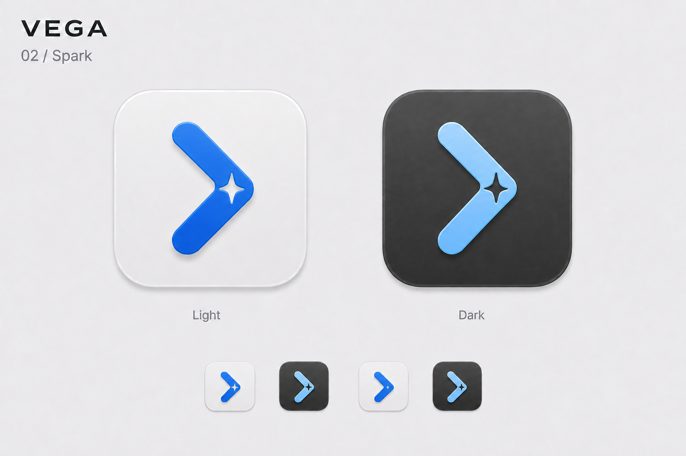
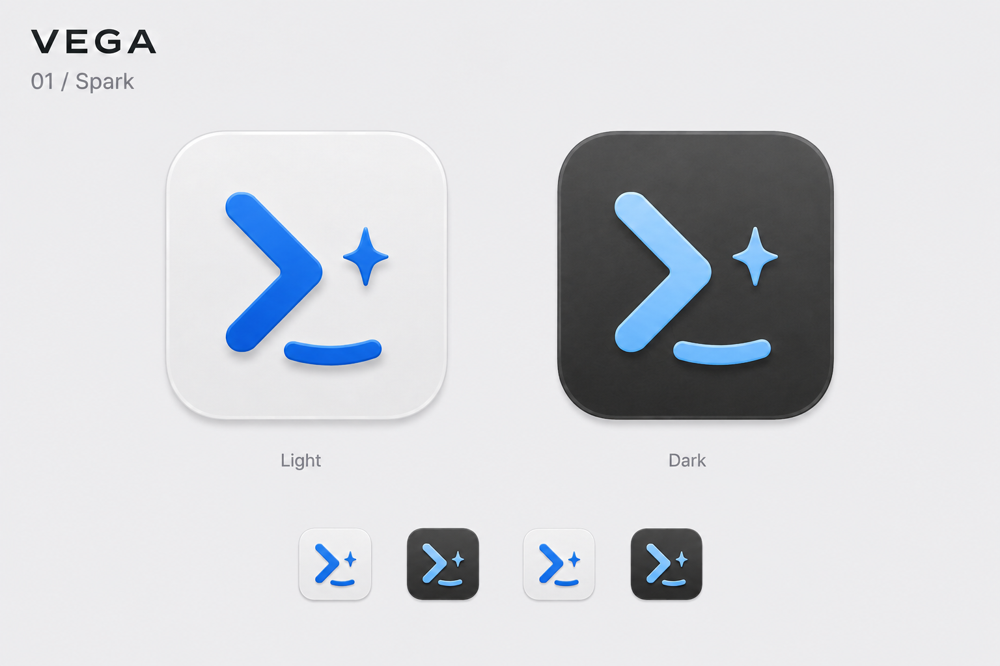
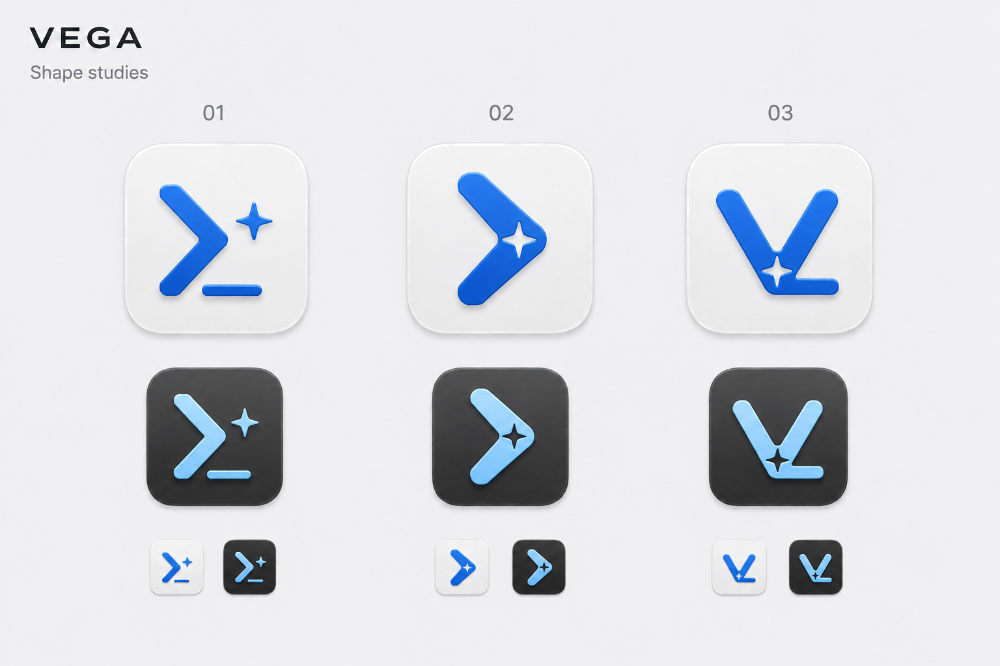
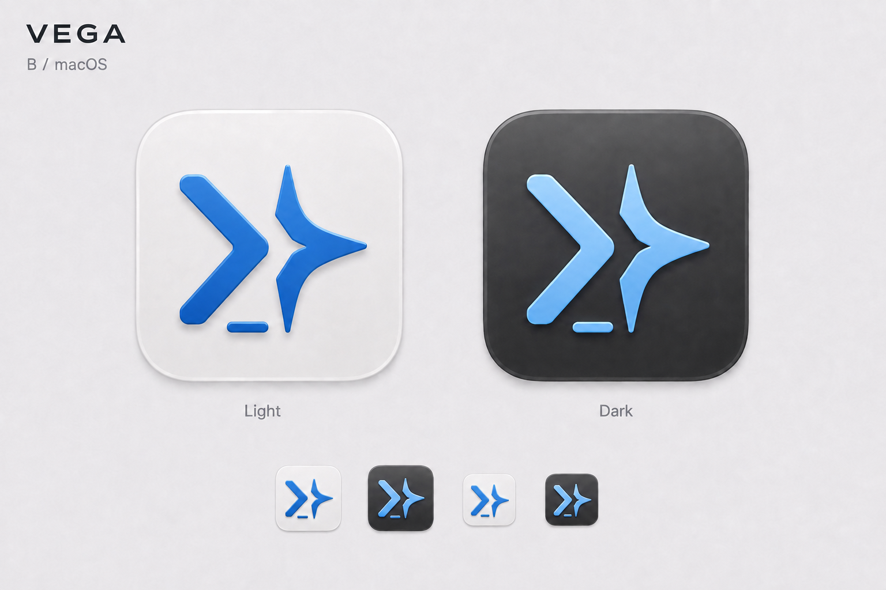
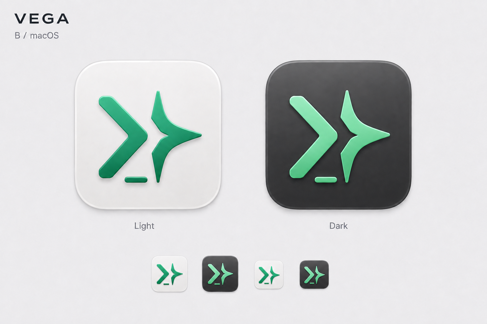
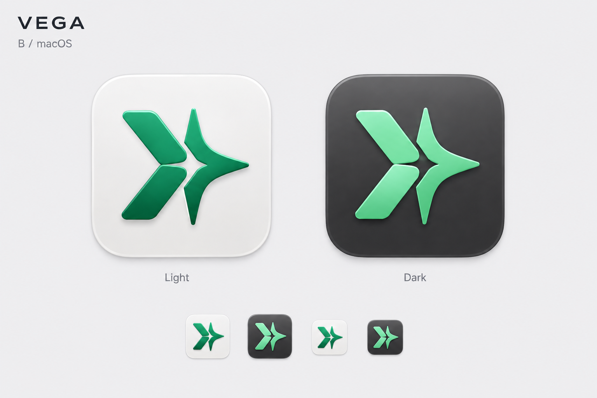
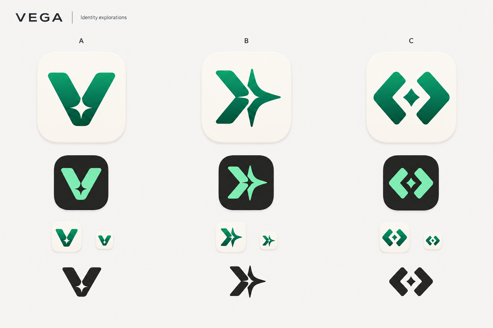

# R16 — Vega 新标识方案

2026-09-06。依据 [原Logo理念](../../LOGO.md) 与 [R16设计规格](../../../../docs/vega-r16-logo-redesign.md)重新探索。终端执行、导航之星与祖母绿品牌色是延续的线索，重新设计图形轮廓和负空间关系。

## 当前选择：01，单星与轻微笑意

追加比较：用户要求给此前02也换上修长星形。[02修长星形切口稿](vega-blue-02-slender-spark.png)已完成，保留整体 `>`、蓝色和高光，只精修内部单星孔；没有移入01的光标/笑脸。此请求不自动覆盖用户此前选择01。

主Agent目视确认两枚主图的星孔/外轮廓关系，缩略星孔大小仍有生成差异，后续需统一矢量。完整内置imagegen提示词见[PROMPTS.md](PROMPTS.md)。

用户选择01，并要求接近 `✨` 主星的轮廓、整体略有笑脸感；最新明确约束是每个图标只要一颗星。已完成[单星微笑精修稿](vega-blue-01-single-spark-smile.png)：保留终端 `>`，采用修长曲边四角星，将光标轻轻上扬。蓝色、柔和高光和浅深底板延续。

主Agent目视检查两枚主图和四枚缩略图，每个图标都是单星。内置imagegen生成，[完整提示词](PROMPTS.md)已记录用户纠正；这是静态设计预览，未进行生产矢量或实机小尺寸验收。

## 历史三轮廓探索（用户已选01）

用户认可蓝色后要求换形状，[三轮廓对比稿](vega-blue-shape-studies.png)在统一材质下探索；随后用户选择01，进一步的单星精修见上方。

| 候选 | 轮廓 | 主Agent判断 |
|---|---|---|
| 01 | 紧凑 `>_` 和小导航星 | 用户选中；终端含义最直接，已完成单星/微笑精修 |
| 02 | 星形切口融入完整 `>` | 初轮主Agent推荐，现作为备选存档 |
| 03 | 带终端折线、星形切口的V | 名称识别更强，终端含义较隐晦 |

主Agent已目视比较浅深外观和缩略构图。内置imagegen生成，完整提示词见[PROMPTS.md](PROMPTS.md)。此前02推荐已被用户选择01替代；生产矢量和实机小尺寸验收后续执行。

## 已认可的蓝色与材质参考（此前B轮廓）

用户要求把当前图标换成合适的蓝色。[蓝色精修稿](vega-logo-b-macos-terminal-blue.png)已完成：浅色采用宝石蓝，深色采用柔和冰蓝，连续 `>`、短横光标、导航星及细高光/材质保持。主Agent已目视确认两种外观和四枚缩略图的配色替换。目标中间色为浅色 `#3478D8`、深色 `#8FC7FF`，生成位图不作为精确色值保证。

内置imagegen生成，完整提示词见[PROMPTS.md](PROMPTS.md)。当前仍是静态设计预览；以下绿色版本是图形与材质演进记录。

## B方向及macOS材质探索（绿色历史稿）

最新反馈：用户认可高光和柔和配色，希望左侧更像终端。已完成[终端识别精修稿](vega-logo-b-macos-terminal.png)：把两段斜线连成完整、等粗的 `>`，加一条短横光标，保留右侧导航星与已有材质。新稿为当前图形方向，下面上一版继续作为材质参考。主Agent已目视确认两种外观和缩略构图；完整内置imagegen提示词见[PROMPTS.md](PROMPTS.md)。

用户选中第二版B，并要求结合macOS设计风格。精修保留终端折角、四角导航星和中心留白，使用柔白/石墨底板、祖母绿/薄荷绿前景、细边缘高光和轻微浮起层次。以下精修图是当前视觉方向；A的初轮推荐不再作为后续任务依据。

内置imagegen编辑原三方向图的B列，输出1536×1024不透明方案板。主Agent目视确认浅深外观、图形识别和缩略构图；这仍是材质预览，后续需统一矢量几何、保留832/1024及96px透明外边距，实测Dock/Launchpad。图中小图不是精确16/32px测试结果。

精修输出：`vega-logo-b-macos.png`。SHA-256：`2416268fa4d41448161f5c3203a445f47c8e711eab9b78ce643a6d2a309d36df`。完整提示词见[PROMPTS.md](PROMPTS.md)。本轮未替换应用SVG/ICNS或安装图标。

## 初轮方向记录

| 方向 | 设计含义 | 主Agent判断 |
|---|---|---|
| A · V中的导航星 | 用V承担名称识别，星形由内部留白构成；两者读成一个完整符号 | 初轮推荐，现作为备选存档；用户已选择B |
| B · 执行星芒 | 保留终端折角与星芒，改为更清楚的负空间连接 | 用户选中；终端身份和旧品牌连续性明确，已完成macOS材质精修 |
| C · 命令坐标 | 双折角围合一个中心菱形，强调精准与工具属性 | 结构稳定，不过容易与常见代码括号符号混淆 |

初轮图包含浅色、深色、单色和缩略形式，保留作探索过程。生成图中的小尺寸仅用于构图观察，不是精确16/32px像素网格或原生Dock验证。后续生产矢量以用户选中的B为准，统一各版本几何，沿用R15居中832/1024主体和外围96px透明留白的导出约束。

初轮最终对比图是 `vega-logo-directions.png`；首次输出 `vega-logo-directions-first-pass.png` 的背景/光晕过重，仅作为迭代记录。第二次只整理背景、阴影和文字对比度。完整内置imagegen提示词见 [PROMPTS.md](PROMPTS.md)。
