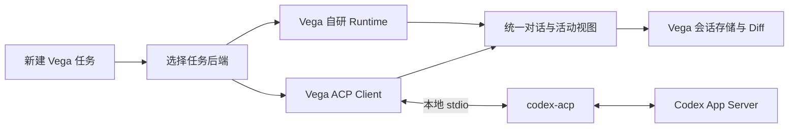

# Vega ACP 接入 Codex 调研

日期：2026-10-05，Asia/Shanghai。状态：调研结论与实现建议，尚未冻结为实现规格。

目标是让用户在 Vega 新建任务时选择 Codex，由 Codex 完整执行编码任务。用户已确认这一使用方式。本文给出协议选择、现有架构改动、会话与权限设计，以及完整交付所需的验收范围。

**建议采用 Vega ACP Client → codex-acp → Codex App Server 的接入链路。** Vega 管理任务界面、进程、审批和记录；Codex 管理模型调用、工具执行与上下文。通用 ACP 部分与 Codex 专属扩展分开适配，保留 Vega 自研 Runtime 作为另一种任务后端。

本轮证据来自官方规范、已发布适配器源码、Vega 当前代码及本机 CLI 帮助。运行兼容性、登录、真实编码和重启恢复尚未验证。

已根据用户确认的使用方式补充 [A4 首版规格草案](vega-acp-codex-v1-spec.md)，包括任务后端、session 绑定、外部审批、停止/恢复与实施卡建议。草案尚未进入实现。

## 已核对的协议与上游版本

| 项目 | 当前证据 | 对 Vega 的影响 |
|---|---|---|
| ACP 协议 | 稳定 v1；v2 仍为 draft，Rust SDK 使用独立的 unstable_protocol_v2 开关 | 首版选择稳定 v1，并校验 initialize 返回的 protocolVersion |
| 官方 Rust SDK | agent-client-protocol 发布版 v2.2.0；Rust 最低版本 1.88，schema 依赖 1.9.1 | SDK 的包版本 2.2.0 与协议 major version 是两个版本体系 |
| Codex ACP 适配器 | 新维护仓库 agentclientprotocol/codex-acp，发布版 v2.1.1 | 采用新适配器，避免基于已经迁移的旧 Zed 实现开始接入 |
| 适配器运行依赖 | v2.1.1 声明 @openai/codex ^0.159.1、TypeScript SDK ^1.5.0；npm 包包含 Codex 依赖 | 发布时锁定实际解析的依赖、运行时与完整性信息 |
| 本机 Codex CLI | codex --version 返回 codex-cli 0.157.0；CLI 帮助提供 app-server，没有 acp 子命令 | 使用 CODEX_PATH 指向本机 CLI 的组合需要另行验证 |
| 本机 App Server | app-server --help 提供默认 stdio://，并标为 experimental | 首版使用本地 stdio；Vega 显示连接与版本错误 |

版本证据：[Rust SDK 发布版](https://github.com/agentclientprotocol/rust-sdk/releases/tag/v2.2.0)、[SDK 清单](https://github.com/agentclientprotocol/rust-sdk/blob/v2.2.0/Cargo.toml)、[SDK 稳定与 draft API](https://github.com/agentclientprotocol/rust-sdk/blob/v2.2.0/README.md)、[Codex 适配器发布版](https://github.com/agentclientprotocol/codex-acp/releases/tag/v2.1.1)、[适配器依赖](https://github.com/agentclientprotocol/codex-acp/blob/v2.1.1/package.json)。

这里的 ACP 指 Agent Client Protocol。其客户端用于承载完整编码 Agent 的会话；Vega 现有 MCP 接入用于向 Agent 提供工具。两个模块需要各自保留会话与权限边界。[ACP 架构](https://agentclientprotocol.com/get-started/architecture)

## 接入方式选择

| 方式 | 能解决的需求 | 主要代价 | 建议 |
|---|---|---|---|
| 通用 ACP Client 加 codex-acp | 完整 Agent 会话、流式活动、审批、恢复；后续可接其他 ACP Agent | 需要管理适配器进程和版本，并处理少量扩展 | 作为 Vega 的主接入方式 |
| 直接接 Codex App Server | 直接访问 Codex 的线程、turn、工具与审批接口 | Vega 自行维护 Codex 协议映射，后续其他 Agent 仍需另一套接入 | 保留为特殊能力的后续选择 |

Codex 官方 App Server 使用自己的双向 JSON-RPC 消息与 thread/turn/item 模型，stdio 使用 JSONL。ACP 适配器负责把两套会话及事件转换。这个选择是结合用户需要开放 Agent 后端做出的架构建议。[OpenAI App Server 文档](https://learn.chatgpt.com/docs/app-server)、[适配器职责](https://github.com/agentclientprotocol/codex-acp/blob/v2.1.1/README.md)

## 适配器已经覆盖的能力

v2.1.1 的 initialize 源码声明 loadSession、resume、list、close、delete、additionalDirectories，支持图片和嵌入上下文，MCP HTTP 为 true，旧 SSE 为 false。实际调用须以每次握手结果为准。[能力声明](https://github.com/agentclientprotocol/codex-acp/blob/v2.1.1/src/CodexAcpServer.ts#L362)

| 能力 | 已核对的上游行为 | Vega 需要补的部分 |
|---|---|---|
| 流式回复与工具活动 | 支持文本、思考、命令、文件变更、MCP、计划等事件 | 统一展示，保留外部 Agent 来源 |
| 权限审批 | 命令、文件修改及权限申请转换为 ACP request_permission | 展示真实 options，返回用户选择的原始 optionId |
| 会话恢复 | load 会回放历史，resume 不回放历史 | 持久绑定、完整回放事务、恢复与去重 |
| 模型与推理设置 | 返回会话 configOptions | 以 Agent 返回值生成控件与保存确认 |
| 上下文用量 | 发送 usage_update 的 used 和 size；缺少有效容量时不发送 | 外部用量来源、未知态及恢复后的快照 |
| 费用 | 已核对的 Codex usage_update 实现没有 cost 字段 | 缺失费用显示未知，不能套用自研 Provider 账单 |
| 高级能力 | AIR 专属扩展、subagent 等依赖协商 | 首版不声明尚未实现的扩展 |

费用结论来自具体实现：[Codex 用量事件](https://github.com/agentclientprotocol/codex-acp/blob/v2.1.1/src/CodexEventHandler.ts#L1153)。ACP 通用协议允许附带累计 cost，但它是可选值。[Session usage](https://agentclientprotocol.com/protocol/v1/prompt-turn#session-usage-updates)

## Vega 当前架构需要改动的位置

现有 Provider 的 chat_stream 接口负责一次模型请求；app_agent 的 worker 构造 Tools、Store、Provider，然后进入自研 Agent 循环。ACP Agent 自己完成这个循环。建议在任务执行入口选择后端，让 ACP 事件进入会话层；外部工具活动仅用于显示和记录，由 Codex 执行。

| 模块 | 当前入口 | 建议改动 |
|---|---|---|
| 任务调度 | crates/vega/src/app_agent.rs；window/agent.rs | 引入 Native 与 ACP 任务后端分派，共用运行归属、取消与后台状态 |
| 协议与进程 | workspace 当前没有 ACP crate | 新增无 GPUI 依赖的 vega_acp，封装 SDK、进程与 capability 协商 |
| 会话映射 | crates/vega_conversation/src/agent；types/events.rs | 添加外部消息、工具、审批与失败的类型化投影 |
| 持久化 | crates/vega_conversation/src/types/thread.rs；vega_store | 增量 migration 保存后端、profile 与外部 session 绑定；旧任务默认 Native |
| Composer 与设置 | crates/vega_ui/src/conversation_stream；settings | 新任务 Agent 选择器、连接状态、Agent 配置控件 |
| 权限交互 | agent/permission_queue.rs；types/permission.rs | 增加可承载任意 options 的外部审批请求与一次性 responder |
| 用量与 Review | types/usage.rs；现有 Git/Diff 服务 | 标注数据来源，区分上下文与账单，刷新真实工作区 Diff |

代码定位：[Provider](../crates/vega_runtime/src/provider.rs)、[任务 worker](../crates/vega/src/app_agent.rs)、[会话事件](../crates/vega_conversation/src/types/events.rs)、[Thread](../crates/vega_conversation/src/types/thread.rs)、[审批队列](../crates/vega_conversation/src/agent/permission_queue.rs)。

上述模块划分是建议。实现前需冻结共享类型、新增依赖清单和 migration；UI 继续通过 conversation 层访问状态，协议层保持 headless。

## 新建 Codex 任务的完整流程

1. 用户选择项目或 worktree，在新任务草稿里选择 Codex。记录草稿意图，并显示 Agent 连接、认证和可执行文件状态。
2. 连接阶段启动已配置的适配器并 initialize，保存协商结果。首次发送用户消息时创建 Vega 任务与外部 session，遵守现有首页草稿延迟落库行为。
3. session/new 固定实际工作目录与授权的附加目录；接收配置选项后，应用有效选择并等待确认，再发送 session/prompt。
4. ACP 更新经 conversation 层上屏并落库：回复、思考、工具活动、命令输出、文件变更、用量和状态。真实 Git 工作区变化继续驱动 Review。
5. 审批请求进入应用持有的队列；切换任务后请求仍归属于原任务。用户选择后回复给 Codex，继续执行。
6. 用户停止时发 session/cancel，同时结束尚未回答的审批。UI 显示正在停止，收到 prompt 的终态响应才确认停止完成。
7. 重启后恢复已绑定的外部 session，核对工作目录、配置与权限，再继续后续消息。

**首版验收终点**：用户能从 Vega 创建 Codex 任务，在选定工作区完成文件修改和命令执行，审阅结果，停止任务，并在重启后继续同一会话。

## 会话身份与恢复设计

建议持久化 agent_profile_id、backend_kind、external_session_id，以及绑定所需的工作区身份、适配器版本和协议版本。运行时再用 connection_generation、run_id 和 request_id 区分旧连接、当前轮次与待处理请求。

Vega 的本地 thread ID 与外部 session ID 各自保持稳定。首版将执行后端绑定到任务，现有 Native 任务继续走原来的执行链。跨后端转换历史需要另设产品规则。

恢复分为两种可观察操作：

- 本地历史完整且外部支持 resume 时，使用 session/resume。
- 本地历史需要重建时，使用 session/load；回放先写入暂存投影，load 成功后再提交。回放期间禁止把历史工具事件解释为新的执行指令。
- 消息 ID 是可选值。缺少稳定 messageId 的 Agent 应以完整回放重建历史，不能按消息文本猜测去重。
- 未收到终态响应时发生断连，标记为需要恢复或确认结果。恢复过程中检查外部历史和实际工作区，避免自动重复发送可能已经执行的 prompt。

这些行为依据：[Session setup](https://agentclientprotocol.com/protocol/v1/session-setup)、[Message IDs](https://agentclientprotocol.com/protocol/v1/prompt-turn#message-ids)。暂存、幂等及重发策略属于 Vega 的实现建议。

## 事件与配置映射

| ACP 输入 | Vega 处理建议 |
|---|---|
| agent_message_chunk | 追加到对应外部消息，沿用有界批量刷新 |
| agent_thought_chunk | 思考活动；字段缺失时保持未知 |
| tool_call 与 tool_call_update | 按 session 加 toolCallId 合并可选字段；保存外部工具类别、标题、内容与状态 |
| plan | 展示外部计划；规划模式由 Agent 配置决定 |
| config_option_update | 替换完整配置状态，更新模型、推理与模式菜单 |
| session_info_update | 更新外部标题等元数据，遵守 Vega 用户改名规则 |
| usage_update | 保存上下文快照和可选累计费用，标明来源 |
| prompt StopReason 或 JSON-RPC error | 区分自然结束、限制、拒绝、取消和执行失败 |

ACP v1 的 session/prompt 响应表示该轮终态；v2 draft 的接受响应与后续完成观察语义不同。首版严格按 v1 处理。[Prompt turn](https://agentclientprotocol.com/protocol/v1/prompt-turn)、[Rust SDK v2 说明](https://github.com/agentclientprotocol/rust-sdk/blob/v2.2.0/md/protocol-v2.md)

配置优先使用会话响应中的 configOptions 字段，以及 session/set_config_option 方法，按照 Agent 返回的选项顺序与原始 value 操作。响应包含完整配置状态，模型变化可能同时改变推理档位。未知类型保留 Agent 默认行为，并显示当前支持范围。[Config options](https://agentclientprotocol.com/protocol/v1/session-config-options)

Codex 还存在 terminal_output_delta 等输出约定。Codex 适配层需要单独消费已实现的扩展；通用 ACP 层只声明真实实现的能力。[Codex 客户端能力](https://github.com/agentclientprotocol/codex-acp/blob/v2.1.1/src/tool-calls/ClientCapabilities.ts)

## 权限与认证

权限 UI 必须保留 Agent 提供的名称、说明与 optionId。协议中的 allow_always 是 UI 提示，具体授权作用域由 Agent 的选项定义决定。用户选择、停止、断连和过期请求都需要一次性终结，旧连接的审批结果不能投递到新连接。[权限请求](https://agentclientprotocol.com/protocol/v1/tool-calls#requesting-permission)、[Codex 审批映射](https://github.com/agentclientprotocol/codex-acp/blob/v2.1.1/src/permissions/CodexApprovalHandler.ts)

建议 Codex 编码任务初始选择 workspace-write，并明确显示其审批模式。适配器的 workspace-write 使用 on-request 与用户审批；其默认 agent 模式使用自动审批审查。read-only 仍可请求额外授权。Vega 的只读、确认、自动、Full access 与这些预设并非逐项等价，需在规格中单独定义映射。[Codex 模式定义](https://github.com/agentclientprotocol/codex-acp/blob/v2.1.1/src/AgentMode.ts)

登录优先由 Codex 管理。Vega 展示认证状态并启动适配器提供的认证流程，OAuth 凭据留在 Codex 侧。API key 或自定义网关接入需要定义独立的凭据传递边界。官方 App Server 的现有认证用于本地或开源应用；商业或托管接入需要按官方 Sign in with ChatGPT 路径设计。[OpenAI 认证说明](https://learn.chatgpt.com/docs/app-server#auth-endpoints)

结构化追问可通过协商后的 elicitation/create 接入。表单与 URL 模式各自声明支持能力，URL 交互需要先展示目标并取得用户同意，凭据不经普通表单收集。[Elicitation](https://agentclientprotocol.com/protocol/v1/elicitation)

## MCP Skills 与工作区操作

ACP session/new、load、resume 可以携带 MCP 配置。首版不导出 Vega 的 MCP 或凭据，Codex 使用的本地配置在 Agent 设置中明确标识。后续共享 MCP 时，再按协商结果支持 stdio 与 HTTP，并冻结用户授权、同名配置、启动失败和凭据传递规则。`mcpServers: []` 只说明 Vega 没有传入服务器，不能据此保证 Codex 没有自己的 MCP 配置；需要验证实际启动配置及覆盖规则。[MCP session 配置](https://agentclientprotocol.com/protocol/v1/session-setup#mcp-servers)

Vega Skills 的批准与撤销状态由自研 Runtime 管理，Codex 有自己的技能加载路径。首版显示实际执行方与可用命令；共享 Vega Skills 需要后续定义导出、审查和撤销契约。

fs/read_text_file、fs/write_text_file 和 terminal/* 是 Client 可选能力。只有完成工作区授权、文件冲突与终端生命周期支持后才声明它们。Codex 自己执行的命令与文件改动继续通过工具活动和真实 Git Diff 展示。[Filesystem](https://agentclientprotocol.com/protocol/v1/file-system)、[Terminals](https://agentclientprotocol.com/protocol/v1/terminals)

现有 Vega 写工具的 checkpoint 属于自研执行链。外部任务的撤销能力需要真实修改前的恢复点；仅接收修改后的 diff 不足以复用现有 Undo 承诺。

## 进程与分发

建议首版每个活动外部任务持有一个适配器连接，跨轮次复用；设置并发上限、空闲释放策略和连接归属。生命周期按启动、握手、认证、就绪、执行、停止、关闭与失败管理，取消使用现有 CancellationToken。

退出顺序先取消当前轮次，处理待审批，再在支持时关闭 session，最后等待拥有的进程退出。超时清理只针对本次启动且身份仍匹配的进程。切换当前视图不等于结束后台任务。[ACP stdio](https://agentclientprotocol.com/protocol/v1/transports)

调研阶段建议使用锁定版本的 npm 适配器及其兼容 Codex 依赖。生产分发需选择用户配置的已安装命令，或 Vega 管理的 helper 与运行时。v2.1.1 的 GitHub Release 当前没有二进制附件；仓库虽然提供 Bun 编译脚本，不能据此认定现成 macOS 包已可用。[发布资产](https://github.com/agentclientprotocol/codex-acp/releases/tag/v2.1.1)、[打包脚本](https://github.com/agentclientprotocol/codex-acp/blob/v2.1.1/package.json)

配置中的 executable 使用已验证的绝对路径与参数数组，并记录可执行文件身份。将 adapter、Codex 及运行时升级作为一个兼容组合处理。读取项目后直接自动安装或执行其提供的命令，不属于当前方案。

v2.1.1 仅在 APP_SERVER_LOGS 被设置时启用文件日志，而 prompt 处理代码会把输入放入日志上下文。Vega 默认保持该日志关闭，对 stderr 和可见错误进行限量、脱敏处理；诊断导出保存结构化状态。[Logger](https://github.com/agentclientprotocol/codex-acp/blob/v2.1.1/src/Logger.ts)、[Prompt 日志位置](https://github.com/agentclientprotocol/codex-acp/blob/v2.1.1/src/CodexAcpServer.ts#L2858)

SDK v2.2.0 的公开传输架构使用 unbounded channels。Vega 需要审查并限制完整读入/分派路径的积压；只限制 UI 队列不足以证明整个进程内存有界。具体限制与 SDK 接入策略应由协议核心卡先验证。[SDK 传输架构](https://github.com/agentclientprotocol/rust-sdk/blob/v2.2.0/md/transport-architecture.md)

## 建议实施顺序

以下是待进入实现规格的工作拆分，本轮没有领取实现卡或改变既有功能状态。

| 顺序 | 工作包 | 完成判据 |
|---|---|---|
| 1 | 后端边界与协议核心 | 共享类型、profile、migration、握手与进程状态机确定，旧任务保持原行为 |
| 2 | Codex 任务完整执行 | Agent 选择、发送、流式活动、审批、真实编辑、命令执行、停止与后台任务连通 |
| 3 | 恢复与用量 | load/resume、断连、重启、回放去重、未知费用与工作区变化处理连通 |
| 4 | 配置与交付 | 认证、模型配置、MCP 边界、helper 分发、原生验收与版本回归记录完整 |

这些工作有共享类型与状态机依赖，应按顺序集成。代码实现按仓库规则交给专用子 Agent，主 Agent 负责规格、审查与集成。

## 待执行的验收矩阵

本表定义后续实现的验收要求，全部为未执行。自动门禁采用进程内协议与业务替身；真实进程、账号和 UI 验收单独留证。

| 用例 | 操作与预期 | 证据范围 |
|---|---|---|
| A01 | 新任务选 Codex，首次提交才创建任务；旧任务加载为 Native | 存储迁移与 GPUI 业务 |
| A02 | executable 缺失、退出或 protocolVersion 不支持，显示准确错误且不遗留运行状态 | 故障注入；原生界面 |
| A03 | 未登录时完成认证；取消认证后保留草稿 | 模拟认证状态；真实账号 |
| A04 | 文本、图片、文件上下文按 capability 发送；不支持时给出明确反馈 | 协议解析；真实调用 |
| A05 | Codex 在隔离工作区实现一个小功能，命令输出与真实 Git Diff 一致 | 真实编码任务 |
| A06 | 接收部分工具更新、重复更新和终态更新，活动卡正确合并且不重复执行 | 协议回放与存储 |
| A07 | 审批允许、拒绝、取消及多选项场景返回原 optionId，结果只生效一次 | 业务与真实审批 |
| A08 | 审批等待时切换会话，请求归属正确，后台任务继续 | GPUI 业务与原生界面 |
| A09 | 流式回复或工具运行时停止，处理晚到更新并等待 cancelled 终态 | 故障注入；真实停止 |
| A10 | 工作目录、额外目录与模式按 session 固定，外部写入与联网按实际策略处理 | 业务与真实 sandbox |
| A11 | app 重启后 resume 同一 session；load 重建历史不重复消息或工具动作 | 存储回放；真实重启 |
| A12 | 部分历史回放后断连，不提交半份历史；无法确认的 prompt 不自动重发 | 业务与故障注入 |
| A13 | 切换模型使推理选项改变，失败时保留 Agent 确认的原状态 | 配置回放与原生界面 |
| A14 | usage/cost 缺失显示未知；重复累计快照不重复计费 | 业务与持久化 |
| A15 | MCP 同名、失败、禁用及权限交互遵守冻结策略；Skills 显示实际来源 | 业务与授权集成 |
| A16 | helper/Codex 崩溃、关闭及升级，释放正确进程、审批与任务 owner | 生命周期与真实进程 |
| A17 | prompt、文件内容与凭据不进入默认诊断日志；错误导出限量脱敏 | 解析与诊断业务 |
| A18 | Native 发送、并发、停止、权限、模型选择、历史与 Review 继续正常 | 定向原有回归与原生验收 |

## 下一步

已将确认的用户流程整理为 A4 首版规格草案。下一步评审共享类型、初始权限、资源上限、依赖与分发组合，建立实现任务。当前调研证明接入路径存在；完整兼容性仍需上述矩阵给出运行证据。
